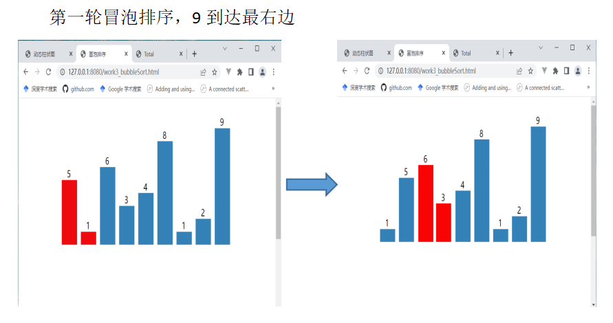
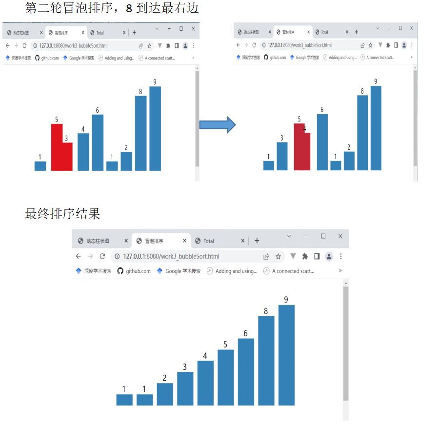
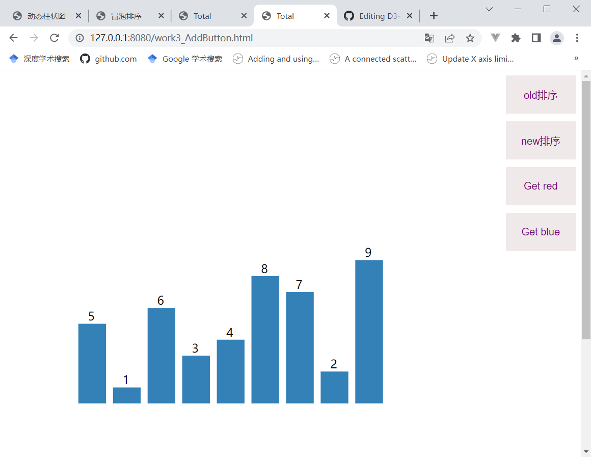
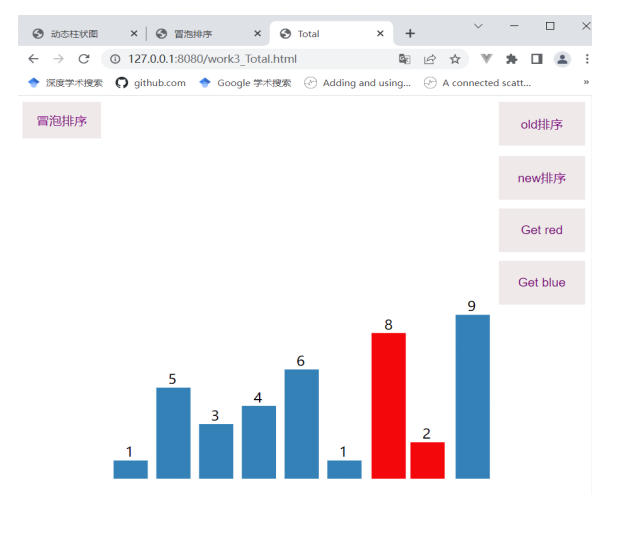
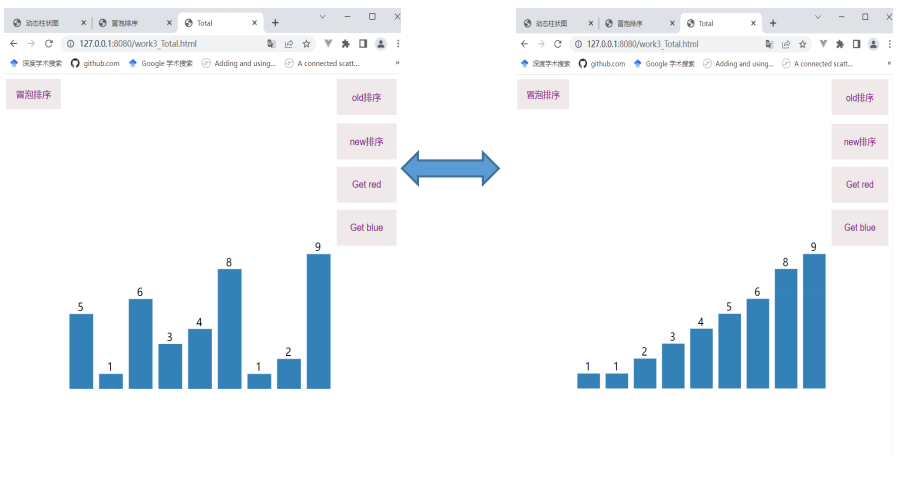
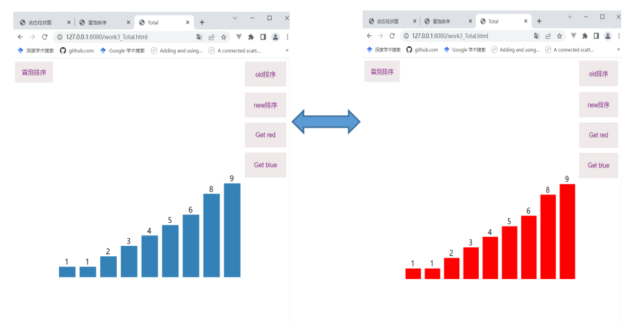

# D3-BubbleSort 用D3简单实现了一个冒泡排序

# 1.视频展示
    

# 2.页面展示
    2.1 柱状图效果（文件work3_DynamicRect）
            
    2.2 冒泡排序实现（文件work3_BubbleSort）

    

    2.3 添加一些小功能（文件work3_AddButton）

    2.4 综合视图（文件work3_Total）
    可以自由切换排序前（old排序）和排序后（new排序）
    可以自由切换颜色

# 3.总文件D3-BubbleSort里不同类型文件的介绍
# showVideo
视频文件
# D3-BubbleSort
代码文件
# yuanbo
截图文件
