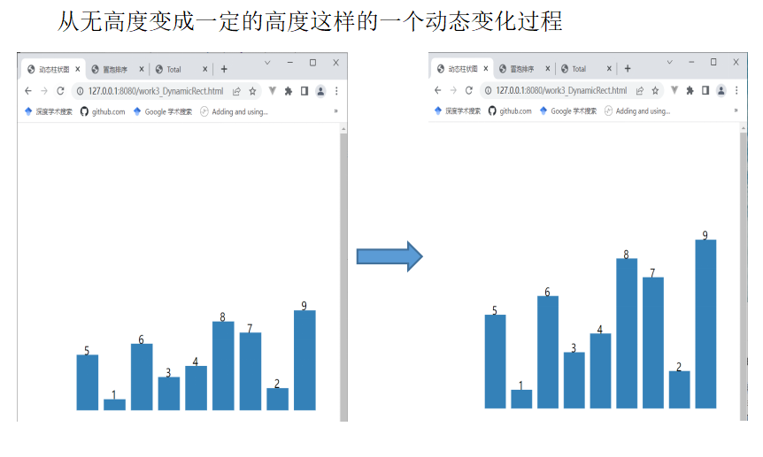

# D3-BubbleSort

# 1.视频展示

# 2.页面展示
    2.1 柱状图效果实现（文件work3_DynamicRect）

    2.2 冒泡排序实现（文件work3_BubbleSort）

    

    2.3 添加一些小功能（文件work3_AddButton）

    2.4 综合视图（文件work3_Total）

# 3.总文件test里不同类型文件的介绍
# css
页面布局文件
# js
d3需要引用一些js文件
# py
爬虫豆瓣同城音乐的活动数据
# csv（已爬虫好）
保存下来的的豆瓣同城音乐活动数据
# html
基本页面
# jpg
用词云，把豆瓣电影数据保存下来的图片
